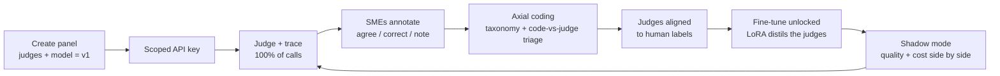

# LabelLoop

**Judge-as-a-service with a built-in eval-to-fine-tune flywheel.**

Teams create a **panel of judges** that a subject-matter expert's judgement is distilled
into, call it as one step inside their own agentic workflow, annotate their own real
traffic, align each judge against that expert, and graduate to a cheaper fine-tuned
open-weights judge served from the same endpoint — without changing a line of integration
code.

We are one call inside someone else's loop, never the orchestration layer. Your agent
generates the artifact; we judge it.

> **Status: early.** The walking skeleton is under construction. The API boots against a
> real Postgres, with the schema, the two-role privilege split and the append-only audit
> guarantee in place, and serves its health, readiness, spec and error-taxonomy endpoints
> (see [Running it locally](#running-it-locally)). There is no evaluation endpoint yet —
> that is the next phase. The one-command `docker compose up` walkthrough arrives with the
> end of M0.

---

## The problem

Teams bolt LLM judgement onto agentic and automated workflows — bug triage, ticket
routing, content labeling, brand and quality gates on generated assets — and then have no
systematic way to answer three questions:

1. **Is it working?** Accuracy is asserted from spot checks, not measured.
2. **Is it getting better?** Prompt edits ship untracked, so "we improved it" is a feeling.
3. **Does it have to cost this much?** A frontier model handles every call forever,
   including the 90% that are trivially easy.

Evaluation, annotation, judge alignment, and fine-tuning each have tooling, but they live
in separate products and ad-hoc notebooks. Nothing carries a team along the whole path
from *first judgement call* to *owned fine-tuned judge* on one continuous data loop.

**And the human half is worse than the tooling half.** Aligning a judge takes a
subject-matter expert, and the industry has no good surface for one. Developers hand-roll
throwaway annotation UIs, the expert's experience is miserable, and the expertise never
accumulates into anything reusable. That gap is the wedge: LabelLoop is the one place a
developer and an expert meet over a shared data model, each getting a surface built for
them.
The handoffs are where the effort dies.

**There is also a regulatory tailwind.** UK (UK GDPR, the Data (Use and Access) Act 2025
automated-decision safeguards, the ICO's AI code of practice) and EU (AI Act logging and
human-oversight obligations) regimes are converging on a single operational demand: an
audit trail proving what an automated system did, why, and who oversaw it. Trace capture,
human annotation, and versioned model lineage are exactly that infrastructure. Teams using
LabelLoop get the evidence as a byproduct of the loop rather than as a separate project.

## Who it is for

Small-to-mid engineering teams embedding judgement into automated or agentic systems,
with at least one subject-matter expert willing to review outputs. The shape we design
against, in two shapes that are the same operation:

- **Triage** — a platform team judging inbound GitHub issues with a panel of
  `is-bug`, `is-feature`, `is-question`, `needs-human`, consumed by their triage bot.
- **Taste** — a marketing team gating generated assets on a designer's judgement with
  `on-brand`, `composition-acceptable`, `colour-balanced`, called from inside their
  generation agent before an asset ships.

Both send an artifact and receive per-judge verdicts. The only difference is where the
artifact came from, which is not a property of our system.

---

## How the loop works



1. **Create a panel.** Name, description, and its judges — each one a single binary
   question with a definition and optional examples. A label set becomes N judges rather
   than one multi-class call, because a verdict you can measure is worth more than a
   verdict you can only read. This is version 1.
2. **Choose the model** your judges run on, and **get a scoped key**. Your agent calls the
   panel as one step in its own workflow.
3. **Every judge runs independently and is traced** — artifact, per-judge verdict and
   reasoning, latency, tokens, cost, model, judge version.
4. **SMEs annotate real traffic** in a focused review surface: agree, correct, and leave a
   free-text failure note.
5. **Failure notes are clustered** into themes and confirmed by a human, producing a
   versioned failure taxonomy.
6. **A judge is configured** from that taxonomy and rubric, then runs against live traffic.
   Judge-versus-human agreement is tracked continuously, and drift is surfaced.
7. **Fine-tuning unlocks** once annotation volume and judge agreement cross thresholds.
8. **Both models can serve** the same endpoint — frontier, fine-tune, or shadow mode
   running both for comparison.
9. **Graduate** by flipping routing to the fine-tune.

The loop closes: serving produces traces, traces produce annotations, annotations produce
a taxonomy and an aligned judge, and the judge plus the annotations produce a fine-tune —
which then serves, and produces more traces.

---

## Why the architecture looks like this

The full decision record is in [`docs/adr/`](docs/adr/). These are the choices that shape
everything else.

### We are the inference path, not an observability sidecar

Requests hit our endpoint, we call the provider, we persist the trace.
([ADR-0001](docs/adr/0001-gateway-traces.md))

Observability vendors must ship client SDKs to capture other people's model calls. We
don't need to — the call already flows through us. That single positional difference has
consequences throughout: trace capture is 100% rather than a sampled, instrumented subset;
sampling and dataset curation see complete traffic; and there is no client-side telemetry
to drift or be misconfigured.

It also creates an obligation. Being on the request path means we own provider latency and
provider failure, so timeouts, retries with backoff and jitter, and circuit breaking are
load-bearing infrastructure rather than a later hardening pass.

### Panel and judge configs are immutable versions

Editing a prompt, a criterion, or a model does not mutate a judge — it creates version
n+1. Every trace, annotation, eval score, and dataset row references the exact version
that produced it. ([ADR-0003](docs/adr/0003-versioning-and-keys.md))

This is what makes "the judge got better" a provable claim instead of an anecdote.
Quality is plotted per immutable version, so a score timeline can never silently span a
prompt change. It is also the foundation of the audit story: any past decision can be
reconstructed — which model ran, on what input, under which prompt, reviewed by whom.

### Two identifiers that are never conflated

The word "trace" means two unrelated things in this domain, so LabelLoop names them
separately. ([ADR-0010](docs/adr/0010-request-id-vs-trace-id.md))

- **`request_id`** — the execution id for one HTTP request. Present on every response,
  success or failure, on every endpoint. This is the id you quote to support.
- **`trace_id`** — a `tr_` identifier naming one *stored evaluation*. Returned only by the
  evaluation endpoints, permanent, and the id that annotation and eval surfaces address.

The failure path is what settles the distinction. If the response envelope carried the
stored-record id, a request that fails before persisting anything would have no id to
return — precisely when a caller most needs one. The execution id exists from the moment
the request arrives, so it is the only candidate that survives failure.

### The audit log is append-only by database grant, not by convention

The application's database role holds `INSERT` and `SELECT` on `audit_events` and nothing
else. No `UPDATE` grant exists. No `DELETE` grant exists. A separate migrator role owns
schema changes, and the application can never alter schema at all.

This is deliberately not application logic. Code that promises not to edit a row is a
promise; a database that refuses the statement is a guarantee. "How do you know nobody
edited the audit log?" is answerable with a test that asserts Postgres itself rejects the
write. The least-privilege split has a second benefit: an injection bug in the application
cannot drop a table it has no rights to.

### Postgres is the only stateful service — and we ship it ourselves

System of record and async job queue are both Postgres (via Drizzle and pg-boss). No
Redis, no separate broker. ([ADR-0006](docs/adr/0006-data-queue-serving.md))

Every additional stateful service is an operational liability. If load testing later
proves real queue or cache pressure, adding one becomes an evidence-driven change with a
documented rationale, rather than a default assumed on day one.

Postgres also ships as one of *our* containers in every environment, including production,
rather than as a managed add-on. The two-role grant model above is only as good as its
weakest environment: a guarantee that holds locally but not in production is not a
guarantee. Owning the container means the roles, the grants, and the append-only
enforcement are identical everywhere, with no environment-specific branches. The deploy
target is chosen to fit that constraint, not the other way around.

### Every provider call goes through one module

There is exactly one place in the codebase that may call a model provider. It owns
timeouts, retries with backoff and jitter, circuit breaking, and token/cost accounting.
Provider errors are translated into our own error taxonomy there; raw provider errors
never reach a caller.

These resilience primitives are written rather than imported. They sit inside the single
gateway every call passes through, which makes them architecture rather than utility, and
keeping them explicit means their behavior under failure is inspectable and testable
rather than delegated.

### External effects sit behind ports

Model providers, clocks, mailers, payment processors, and training drivers each sit behind
a small interface. Real adapters and deterministic fakes both implement it, and both must
pass the same shared contract test. Dependencies are wired once at application
composition — plain constructor parameters, no DI container.

The practical payoff is that the walking skeleton runs on a deterministic fake provider
with no external credentials, and swapping in a real provider is an adapter change rather
than a rewrite. Tests receive fakes through the same seam production uses; nothing is
monkey-patched.

### Errors are a closed taxonomy, and the frontend cannot fall behind it

Every error code is defined once in a shared contracts package, mapped to an HTTP status
and a `retryable` flag. Route handlers throw; a single central handler owns all
serialization. Adding a code requires a change to that package — never an inline string.

The web console imports the same enum and maps every code through an exhaustive switch to
its user-facing treatment. A new backend error code therefore *fails the frontend
typecheck* until someone decides what the user should see. Front-and-back error handling
stays in sync structurally rather than by remembering.

### REST only

The integration surface is plain REST: an OpenAPI spec generated from the same schemas
that perform validation, interactive docs, and documented curl snippets. There is no
client SDK. ([ADR-0002](docs/adr/0002-thin-sdk.md))

Because trace capture is server-side, an SDK would carry requests but no telemetry — added
surface area with little to offer. The spec cannot drift from the implementation, since
both are generated from one set of schemas.

---

## Stack

| Layer | Choice |
|---|---|
| API | Bun + Hono + TypeScript; OpenAPI-generating public routes, RPC for the console |
| Web | React SPA on Vite, TanStack Router + Query |
| Data | Postgres + Drizzle, forward-only migrations |
| Queue | pg-boss (Postgres-backed) |
| Auth | better-auth, self-hosted; scoped API keys are our own |
| Observability | OpenTelemetry (manual instrumentation) → self-hosted Grafana stack |
| Serving (planned) | vLLM with dynamic per-tenant LoRA loading |
| Training (planned) | Axolotl, LoRA/QLoRA, configs committed to the repo |
| Billing (planned) | Stripe metered usage |

Rationale for each is in [`docs/STACK_DECISIONS.md`](docs/STACK_DECISIONS.md) and the
corresponding ADR.

## Running it locally

Nothing here needs a secret. It does now need a database, so the setup is three commands:
copy the committed `.env.example` (exhaustive, and every value in it is a working local
default), start Postgres, then create the roles, migrate and seed.

```bash
bun install && cp .env.example .env
```

```bash
bun run db:up && bun run db:setup
```

```bash
bun run --cwd apps/api dev
```

`db:setup` is three steps with three privilege levels, and they are separate on purpose:

| Command | Connects as | Does |
|---|---|---|
| `bun run db:bootstrap` | superuser | Creates the two roles. The only step needing a superuser, and the only place that credential is used. |
| `bun run db:migrate` | `labelloop_migrator` | Applies the forward-only migration stream. Owns the schema; issues all DDL. |
| `bun run db:seed` | `labelloop_app` | Inserts the demo org, panel, judges and dev key. DML only — it could not alter a table if it tried. |

The API connects as `labelloop_app`, which holds no DDL at all. That is not a convention
it follows; it is a privilege it does not have, and `packages/db` has tests that prove it
by trying.

Postgres publishes on **5433**, not 5432, because a developer machine very often already
has a Postgres and the collision is silent rather than loud — a local install binds the
loopback address and quietly wins, so tooling connects to the wrong database and fails
somewhere confusing. Override with `POSTGRES_PORT` if you want it elsewhere.

Pipe through `pino-pretty` if you want the NDJSON readable — pretty-printing is a pipe,
never an in-process transport:

```bash
bun run --cwd apps/api dev | bunx pino-pretty
```

### What is served today

| Endpoint | What it is for |
|---|---|
| `GET /healthz` | Liveness, plus the version and git SHA of the running build. Touches no dependency, deliberately |
| `GET /readyz` | Readiness: is Postgres reachable, and are migrations current. `503` naming the failing check when not |
| `GET /v1/openapi.json` | The OpenAPI document, generated from the same schemas that validate |
| `GET /v1/docs` | Interactive Scalar reference — the integration surface, since there is no SDK |
| `GET /_demo/rate-limited` | A synthetic `429` with `Retry-After`, for inspecting the error envelope |
| `GET /_demo/boom` | A synthetic `500`, showing that an unexpected error leaks nothing |

Every response is enveloped and carries a `request_id`, on success and on failure alike:

```bash
curl -s localhost:3000/healthz | jq
curl -si localhost:3000/_demo/rate-limited | head -12
```

The two health endpoints answer different questions, and the difference is worth seeing.
Stop Postgres and `/readyz` goes red naming the check, while `/healthz` stays green — if
liveness checked the database, a Postgres blip would get every container killed and
restarted, turning a recoverable outage into a thundering herd:

```bash
docker compose -f infra/docker-compose.yml stop postgres && curl -s localhost:3000/readyz | jq
```

```bash
docker compose -f infra/docker-compose.yml start postgres
```

### The seeded panel

`bun run db:seed` creates the issue-triage panel this project runs on itself, and prints a
fixed development API key. The key is deliberately zero-entropy and self-describing: it is
a real credential in shape only, on a throwaway local database. Real keys are 32 random
bytes, shown exactly once at creation and stored only as a SHA-256 hash — `api_keys` has
no column that could hold a plaintext one.

Its four judges are the reason the schema models polarity as three-valued rather than as a
boolean. `is-bug`, `is-feature` and `is-question` are labels with no valence: they answer a
question without passing or failing anything, so they score nothing and sit outside both
the numerator and the denominator. `needs-human` is the one real gate — answering `true`
*fails*, and it is `required`, so it vetoes the panel whatever the score says.

There is no evaluation endpoint to point the key at yet; that lands at P4.

### Why the demo routes are not in the API docs

`/_demo/rate-limited` and `/_demo/boom` are **deliberately absent from
`/v1/openapi.json` and `/v1/docs`**, and are documented here instead. `/v1` is a
versioned public contract where a breaking change means a new version, so publishing
endpoints there only to delete them later would be self-inflicted contract churn. They
exist because nothing in the walking skeleton legitimately produces a `429` or a `500`
yet, and they are **deleted at M2**, when real rate limiting gives the `429` an honest
source. The other two codes in the required set, `422` and `401`, are demonstrated on
the real evaluation endpoint rather than faked — a malformed body proves that
contract validation actually works, whereas a synthetic route would only prove that a
synthetic route can throw. See [ADR-0015](docs/adr/0015-demo-routes-outside-versioned-surface.md).

---

## Repo layout

```
apps/api          the gateway and platform API
apps/web          console + annotator surface
packages/contracts  schemas, error taxonomy, id types — the single source of type truth
packages/db       schema and forward-only migrations
infra/            containers, compose, load-test scripts, dashboards-as-code
docs/             product definition, architecture decisions, conventions
thoughts/         research and planning trail behind each decision
```

---

## Roadmap

| | Milestone | What becomes true |
|---|---|---|
| **M0** | Walking skeleton | Every architectural seam wired end to end through one thin thread, on a fake provider. One command boots the whole stack. |
| **M1** | Endpoint spine | A real frontier provider, structured output with confidence, server-side traces on every call, hashed scoped API keys. |
| **M2** | Resilience | Per-key rate limiting, timeouts, retries, circuit breaking, and a documented breaking point under load. |
| **M3** | Observability | Distributed traces including LLM spans, cost and latency dashboards, alerting. |
| **M4** | Console | OIDC login, server-enforced roles, panel and judge creation, key management, trace explorer. |
| **M5** | Annotation loop | The annotator surface, sampling strategies, reliability scoring, and the first dogfood tenant. |
| **M6** | Eval harness | Failure taxonomy, an aligned judge with tracked agreement, and an eval suite that gates merges on regression. |
| **M7** | Fine-tune & serving | Dataset curation, LoRA training, held-out comparison, and shadow-mode routing. |
| **M8** | Billing & governance | Metered billing, tier quotas, surfaced audit log, and a compliance control mapping. |

Ordering is fixed in [`docs/BUILD_SPINE.md`](docs/BUILD_SPINE.md).

### Dogfooding

This repository is tenant #1. Incoming issues are judged by a panel through the production API,
annotated by the maintainer, and carried through the full loop in public — including the
parts that go badly. Quality and cost comparisons are published whichever way the numbers
land; a fine-tune that underperforms is a result, not a failure to hide.

---

## Beyond V1

Three directions the V1 data model is deliberately designed to accommodate, in increasing
order of ambition.

**Contribution ledger and annotation royalties.** Annotation today is labor that trains
its own replacement. The ledger inverts that: attribution is mechanical rather than causal
— a contributor's share of the reliability-weighted annotations included in a shipped
training set — with employer-configurable payouts (a bounty per accepted annotation, a
bonus when a fine-tune ships, an ongoing share of metered serving spend on models their
data trained). Paired with the oversight framing that emerging regulation encourages, the
SME's role shifts toward overseer of record rather than disappearing. This is why every
annotation carries an annotator identity and an immutable dataset-version link from the
very first migration: retrofitting attribution onto unattributed data is impossible.

**Expert eval marketplace.** Pairing teams that cannot staff full-time AI engineers with
independent eval engineers offering human evals, axial coding, and rubric design as a
service — matching, reputation tied to verified work quality, payouts through the
platform. V1 ships only the hardest prerequisite: governed guest-expert access that is
time-boxed, panel-scoped, audited, and PII-masked.

**Expertise as a service.** The synthesis. A subject-matter expert with recognized
judgement registers, builds reputation through verified annotation quality, and is
enlisted to seed and steer a panel. Their judgement is distilled into labeled data,
an aligned judge, and eventually a fine-tune running inside a customer's workflow.
Compensation is usage-based through the same ledger. Reputation, attribution, and metering
all reuse V1 primitives, which is what keeps this a roadmap rather than a fantasy.

## Non-goals

Deliberately out of scope, to keep the loop sharp:

- Free-text extraction or generation. **Classification only.**
- More than one open-weights base family, or full-parameter fine-tuning.
- Multi-region deployment, bring-your-own-model uploads, on-prem.
- Compliance *certification*. The platform is designed against SOC 2, ISO 42001, EU AI
  Act, and UK DUAA expectations and publishes a control mapping — framed as readiness,
  never as a certification claim.

On safety, LabelLoop follows a documented shared-responsibility model. Tenant prompt
content, use-case appropriateness, and end-user policy belong to the tenant. The platform
owns its own model surfaces — judge and clustering prompts are hardened against injection
via untrusted trace content — plus transport and storage security and access governance.

---

## How decisions get made here

Architecture decisions are recorded as ADRs in [`docs/adr/`](docs/adr/) at the moment they
are made, including the alternatives rejected and why. The research and planning that
preceded each one is kept in [`thoughts/`](thoughts/) rather than discarded, so the
reasoning behind a choice remains available long after the choice stops feeling obvious.

Reading order for a newcomer:

1. [`docs/PRODUCT.md`](docs/PRODUCT.md) — what is being built
2. [`docs/BUILD_SPINE.md`](docs/BUILD_SPINE.md) — the order it gets built in
3. [`docs/CONVENTIONS.md`](docs/CONVENTIONS.md) — the rules the code follows
4. [`docs/adr/`](docs/adr/) — why each structural choice was made

## License

MIT
