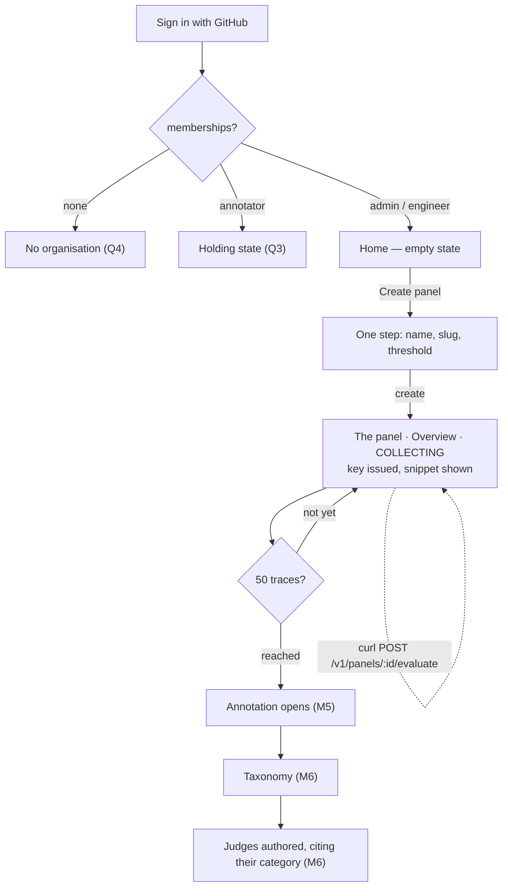

# Console flow map — every console screen, M4 → M8

**Status:** APPROVED 2026-09-14 at the 6a review · **REVISED 2026-09-14 at the 6b review** — the
navigation model changed when the stakeholder reviewed the first shell. §1–§6 describe the
revised model; §7 keeps the 6a answers as they were given, marking the ones §8 supersedes.
**Plan:** `thoughts/shared/plans/complete/2026-09-11_m4-console-auth.md` (phase 6)
**Decisions it works under:** ADR-0055 (the partial Phase A resume), ADR-0056 (sidebar, as
amended 2026-09-14), ADR-0047 (active org per request), ADR-0057 (a non-member org is not
found), ADR-0059 (organisation settings are admin-only)

## What this document is, and what it is not

It answers one question: **does the console flow cohesively** — what screens exist, how a
person reaches each, and what they are scoped to. Flow is an information-architecture
property, so a map answers it without drawing a screen.

It is deliberately **not** a design, and it does not decide the contents of any screen whose
product decisions are open. Where a future screen is named here, only three things are
claimed about it: that BUILD_SPINE or PRODUCT.md schedules it, which milestone, and how it
is reached. What goes on it stays with the milestone that builds it.

**Order is load-bearing** (plan decision 13): this map is reviewed first, then
`console-shell.html` is drawn from it, then `panel-create.html` inside that shell.
A sidebar cannot be designed before its contents are known — and, as §8 records, drawing one
is also how its contents get re-examined.

**Status vocabulary used below.** *Exists* — built, in `apps/web`, unstyled. *M4* — built in
phase 7 or 8 of the current plan. *Scheduled* — a later milestone names it. *Unscheduled* —
PRODUCT.md describes it, no milestone builds it. Nothing marked *Scheduled* or *Unscheduled*
exists; the map is a plan, not a claim.

---

## 1. Where a signed-in person lands

The console and the annotator flow are **two surfaces**, and role decides which one a person
lands on (PRODUCT.md 5.1, 5.5). The engineer console has the sidebar shell; the annotator
surface has **no shell, by design** (ADR-0056). So "where do I land" is resolved before any
sidebar is drawn, and it depends on two facts `GET /internal/me` already returns: how many
memberships, and the role in the active org.

| State | Lands on | Surface | Status |
|---|---|---|---|
| Signed out | Sign in | none — outside both | Exists (`/login`); GitHub button is phase 2's throwaway, rebuilt in phase 8 |
| Signed in, **no membership** | **Create your organisation** — a screen, not an error | none — nothing to navigate | M4 — Q4, answered by ADR-0063 |
| `admin` or `engineer` in the active org | Console · **Home** | console shell | M4 — Q2, as revised by R2 |
| `annotator` in the active org | Annotator session | annotator (no shell) | Scheduled, M5 |
| `annotator` in the active org, **at M4** | a holding state: the shell with no Home and no panel | console shell | M4 — Q3 |
| `guest_expert` | — | — | Unscheduled (M4 "Not now"). The `org_role` enum has carried it since M0; no surface, invite or guard uses it |

**Switching org can switch surface.** A role is per-org (ADR-0014), so an account that is
`admin` in one org and `annotator` in another leaves the console when it switches. That is
correct, and it has a consequence for the annotator surface, which has no shell to hold an org
switcher — see Q5.

---

## 2. The shell's fixed furniture

> **Superseded in part by ADR-0062 (2026-09-17), after the shell was BUILT.** The frame is now a
> **top bar at every level** — wordmark (links Home), the scope as a trail, the organisation, and an
> account menu holding Organisation settings and Sign out — and a **sidebar that exists only inside
> a panel**, carrying the panel switcher and that panel's sections. Home is a grid of panel cards;
> Create panel is a dialog opened by `?new`. Rendered against a real organisation, the one-sidebar
> model left the rail at Home roughly nine-tenths empty, which the drawing below could not show.
> What follows is kept as the record of the approved design; the section nav, padlock/milestone
> distinction, error surfaces and modal temperaments all stand unchanged.

Two levels — **Home** (the organisation) and **a panel** — in **one persistent sidebar**. The
sidebar does not swap its contents when a panel is opened; what it shows below the panel
switcher depends on whether one is (R1).

**Top of the sidebar, in order:**
- **Wordmark**, which also links Home.
- **Home link.** Reads **← Home** when a panel is open, so leaving a panel reads as stepping
  back out of it; reads **Home** and is marked current when you are there (R1).
- **Panel switcher.** On Home it reads *Choose a panel*; in a panel it names that panel. Its
  menu lists every panel in the org, then **Create panel**. There is no "All panels" entry —
  Home is the list (R2).
- **The panel's sections**, directly under the switcher and only while a panel is open — §3.
  A judge's page is reached *inside* Judges, so the sidebar never gains a third level (R8).

**Foot of the sidebar, in order:**
- **Organisation settings** — admins only, and **absent entirely until M8**, when Audit log
  or Billing first ships. Hiding it mirrors the server guard; it never replaces it (R4, ADR-0059).
- **Identity** — email, and role *in the active org*.
- **Organisation** — plain text for an account in one org; a menu opening upward for an account
  in several. Anyone with more than one membership gets it, whatever their role (R3).
- **Sign out.**

**Not in the sidebar, but owned by the shell:**
- **One modal slot** — the one-time key reveal (from Keys, or from the wizard's last step) and
  the revoke confirmation.
- **Three error surfaces**, one per kind of failure — §6.

Not shell furniture, deliberately: saved views (M5 sampling-queue work), notifications, help.

---

## 3. Every screen, by level

**Ordering principle:** a panel's sections follow the core product loop, PRODUCT.md §4 —
the judges it is made of → judge and trace → get key → annotate → axial coding → alignment →
fine-tune — under an Overview that is the panel's home.

**Two kinds of unavailable, and they look different** (R9). A **milestone mark** (M5, M6) means
the screen is not built yet. A **padlock** means it is built and not yours yet: Judges is locked
until an eval pass exists, because a judge must cite the traces and annotations that produced it
(ADR-0061). Traces are never locked.

At M4, Home and three panel sections are live. Every other *scheduled* section is drawn
**greyed out and labelled with its milestone** (plan decision 15; open question 1, answered by the
stakeholder at the 6b review — the labels keep the console honest and give later milestones
something to point back at). **Unscheduled screens get no entry at all**: an inert entry is a claim about
where the app is going, and only BUILD_SPINE can make that claim.

### Home — the organisation's level

| Screen | Milestone | Status | Reached from | Roles |
|---|---|---|---|---|
| **Home** — the panel list now; cross-panel overview cards above it at M6 | M4, grows at M6 | M4 · phase 8. Its M6 contents are `console-dashboard`'s, and **Phase A stays paused** for those (ADR-0055) | sign-in landing; the Home link; the wordmark | admin, engineer |
| Create panel — **one step**: name, slug, threshold (R9) | M4 | **M4 · phase 6c mockup, phase 8 build** | Create panel on Home, including its empty state; Create panel in the switcher menu | admin, engineer |

### A panel — everything in the sidebar's section nav

| Section | Screen | Milestone | Status | Reached from |
|---|---|---|---|---|
| **Overview** | **The panel's home, and its onboarding**: collecting state, progress toward the annotation gate, and the integration snippet carrying the key issued with the panel. Becomes the dashboard at M6 | **M4** | **M4 · phase 8** (R9) | opening a panel; the landing after creation |
| **Judges** | The panel's current version, read-only. **Authoring is LOCKED until an eval pass exists** (ADR-0061); the section shows a padlock and what opens it | M4 (locked, read-only); authoring M6 | **M4 · phase 8** — needs a panel read endpoint the plan did not have (R8, R9) | nav |
| | A judge's page — inside Judges, not a third sidebar level: the panel's traces seen through that judge, its alignment, its versions | first content at M6 | **Direction recorded, contents deferred** (R8) | a judge's row; header "← Judges" |
| **Traces** | Trace table for this panel — **never locked**: a customer reads their own data from the first call | M4 | Exists (unstyled, org-wide); re-skinned phase 7, scoped and extended phase 8 | nav |
| | Trace explorer — filters, expanding payloads | none named | **Unscheduled** — BRIEF defers it unstyled; plan open question 2 | evolves in place from the table |
| | Trace detail — one record, full page | none | **Unscheduled** | a trace row |
| **Keys** | Key list · issue · revoke, for this panel | M4 | M4 · phase 8 | nav; the wizard's final step |
| **Annotation** | Sampling queues — random, low-confidence; judge-disagreement at M6. **Opens at 50 collected traces** (ADR-0061) | M5, M6 | Scheduled · inert at M4 | nav |
| **Taxonomy** | Axial coding · versioned taxonomy · `code`/`llm` triage | M6 | Scheduled · inert at M4 | nav |
| **Alignment** | Session list · one session and its disagreement view | M6 | Scheduled · inert at M4 | nav; a drift alert (where alerts surface is undecided) |
| **Fine-tunes** | This panel's fine-tunes, and routing per judge — frontier, finetune, shadow | M7 | Scheduled · inert at M4 · **level is an assumption, R6** | nav |

Every panel section is `admin` and `engineer` at M4. Taxonomy expects an SME beside the
engineer (PRODUCT.md 5.6), which is M6's to design.

### Organisation settings — the foot of the sidebar, admins only

| Screen | Milestone | Status | Reached from |
|---|---|---|---|
| **Audit log** — append-only event viewer | M8 | Scheduled · **no entry at M4** (R4). M4 already writes its first rows (ADR-0051) | Organisation settings |
| **Billing** — usage, tier quotas, Stripe-hosted where possible | M8 | Scheduled · **no entry at M4** (R4) | Organisation settings |

**The guard is M8's to build, and it is not optional.** `requireRole('admin')` on both routes,
because a hidden link is not access control: an engineer who types the URL must get
`FORBIDDEN` from the server (CONVENTIONS "Keys & auth"; ADR-0059).

### Outside the console

| Screen | Surface | Milestone | Status | Reached from |
|---|---|---|---|---|
| Sign in | none | M0, M4 | Exists | signed out; any 401 (redirect-after-401, phase 8) |
| "Create your organisation" | none | M4 | M4 · phase 8 — Q4, ADR-0063 | sign-in with zero memberships |
| Annotator session | annotator | M5 | Scheduled · **Phase A paused** for it | sign-in as annotator |
| Annotator home | annotator | — | Unscheduled · r1 rejected 2026-08-19 — see Q5 | — |
| API reference (`/docs`, Scalar) | served by the API | M0 | Exists | a link from the key reveal, if 6c keeps one |
| Eval gate on a PR | GitHub | M6 | Scheduled · no console screen at all | the PR |

### Named by PRODUCT.md, scheduled by nothing — no entry

Listed so their absence is a decision rather than an oversight:
members and roles management (would live in Organisation settings) · guest-expert invite (5.1)
· ~~org creation (the "member of nothing" gap)~~ — built at M4 for a member of nothing only, ADR-0063 · the two-sided org financial view (5.10; would
join Home, with its org → panel → judge → key drill-down) · fine-tune unlock and launch (5.8;
M7 says "training UI (CLI is fine)") · adapter download (5.9; blocked on the M7 decision gate)
· annotator reliability and inter-annotator stats (5.5; M5 "Not now") · **cross-panel Traces and
Keys** (R2 — see §4).

---

## 4. Scope: what each level owns

**The organisation** is the tenancy boundary. Every request carries it, and the server refuses
one the account is not a member of with `NOT_FOUND` (ADR-0057). It is set at the foot of the
sidebar because it is the least-touched control in the console — most accounts will have one
membership and never change it (R3) — and it stays visible without the top slot, in every
page header's scope line.

**Home** is the organisation's level. At M4 it holds only the panel list. At M6 it gains
overview cards across panels, and whatever later arrives as the financial view (5.10) joins it.

**A panel** is the working context, and **every section in the sidebar's nav is about exactly
one panel.** There is no "All panels" mode for a section (R2), which is what lets the sidebar
read as one thing. The rule is legible from one fact: *if it is in the section nav, it belongs
to the panel named above it.*

**Organisation settings** are org-level but not a place anyone works, so they are not in the
nav at all — they sit at the foot, for admins (R4).

**Both contexts live in the URL, not in storage.** The reasoning is ADR-0047's own: a
server-side or `localStorage` "active org" lets a second tab silently change what the first is
showing. A URL makes each tab its own context and makes a link shareable. The URL's shape is
phase 7's.

**The cost of one-panel sections, named:** no view of traces across panels, and no list of
every key in the org — revoking keys on three panels means visiting three panels. Nothing in
M4–M7 needs either. M8's audit log carries the cross-panel history, and if a real need for an
org-wide key list appears, it can be added under Home without disturbing this model. The API
is already shaped for it: `GET /internal/traces` and `GET /internal/keys` are org-wide today, so
phase 8 scopes them by panel rather than the reverse.

---

## 5. The M4 flow, step by step — the demo moment

M4's definition of done is this path **on a database with no seeded panel**
(BUILD_SPINE M4). Every arrow is an entry point from §3.

Notes on the transitions that are not obvious:

1. **Creation takes one step and always produces a collecting panel** (R9). There is no judge
   step, no model step and no review, because there is nothing yet to review.
2. **A key is issued with the panel**, and the reveal is the Overview screen rather than a
   dismissible modal: the plaintext exists exactly once and the snippet needs it in place.
   The shell's modal stays for keys issued later from Keys.
3. **The panel opens on Overview, not Traces.** Overview is where the collecting state, the
   progress toward the gate and the snippet live — the only screen with anything to do on it
   until traffic arrives.
4. **The gate is the loop, not a wall.** At 50 traces annotation opens; judges stay locked
   until annotation produces categories, because each judge cites the category it came from.

**Revoke → confirm → the row stays, marked revoked** — revocation is a status flip, never a
delete.

---

## 6. Where errors land

Three surfaces, one per kind of failure (R7). What each says is phase 8's.

1. **Beside a field** — the input was wrong. Stay on the step.
2. **In place of the content** — *this screen* could not be shown: its data failed to load, the
   role does not allow it, or what the URL points at is not available. The sidebar stays
   usable; the content area says why, where the content would have been.
3. **A toast, bottom-right, above everything** — *an action you took* failed, and it may not be
   tied to what is on screen any more (the modal that started it has closed). **It does not
   dismiss itself**: it stays until closed, because the one thing that must be copyable out of
   a failure is its `request_id`, and because an action failure can leave state the user needs
   to know about ("the key is unchanged and still active").

| Code | Surface | Flow consequence |
|---|---|---|
| `VALIDATION_ERROR` with `issues` | 1 — beside the field at each `path` | stay on the step. A refused pin is this, at `judges.N.model` (Deviation 27) |
| `UNAUTHORIZED` | none — a transition | to Sign in, then back to where the user was (redirect-after-401, phase 8) |
| no membership | "Create your organisation", outside the shell | ADR-0063: read from `/me` as an empty list, not a FORBIDDEN — so it no longer shares copy with the next row |
| `FORBIDDEN` — role | 2 — in place of the content | the refusal names the role and the org, and who can change it; it does not list which roles would have been allowed |
| `NOT_FOUND` — the org **or** panel in the URL | 2 — "this link isn't available to your account", with a way to Home | **No silent swap to another org** (R7). Showing Fernhill's traces under a link that promised Northwind's invites misreading whose data is on screen. The console cannot name the org it was sent to: it never had the name, and ADR-0057 answers an unknown and a non-member org identically |
| `NOT_FOUND` — a key being revoked | 3 — toast | the key list refreshes; it may have been revoked already |
| any other code, **loading** a screen | 2 — with `request_id` and Reload | Reload is a user choosing to re-issue a read, which is always safe; the taxonomy's `retryable` flag governs *automatic* retries, not this button |
| any other code, **during an action** | 3 — toast, with `request_id` | retry offered only where the taxonomy marks the code retryable; the toast says what state the action left behind |

---

## 7. Resolved at the 6a review — 2026-09-14

Kept as given, because the 6b revision is only legible against it. The stakeholder took the
recommendation on all eight; Q5 had none to take and is carried to M5. **Q1, Q6 and Q8 are
superseded by §8, Q2 and Q7 are amended by it.**

**Q1. Panel switcher semantics.** — ***Superseded by R2.*** The 6a proposal was a working
context with an *All panels* option, URL-held, under which Traces and Keys showed every panel's
rows. The alternative was the harvest's reading — the whole console always inside one panel.
**Decided at 6a: the All-panels context.**

**Q2. Landing screen for an engineer.** — ***Amended by R2:*** the landing is **Home**, which at
M4 *is* the panel list, so the substance stands. Proposed: Panels, because on M4's no-seed
database it is the only screen with an action on it, and every other section needs a panel to
exist first. Once `console-dashboard` exists (M6) it is the more natural landing. **Decided:
Panels at M4; revisit when the dashboard ships.**

**Q3. What an annotator sees at M4 — and a finding.** The annotator surface is M5, so at M4
an annotator who signs in gets *something* in the console. **Finding:** `GET /internal/traces`
is the one internal route without `requireRole`, so today an annotator's session can read it.
The trace list currently carries no verdicts or confidence, but phase 8 extends it with judge
context — and harvest blocker 2 (confidence withheld from annotators, so agreement is not
inflated) is open. Routing an annotator into the trace table would decide that blocker by
default. **Decided:** at M4 an annotator lands on a holding state with no live sections, and
the trace route's guard is decided in phase 8 alongside the table's extension — not here.

**Q4. "Member of nothing" — a screen or an error?** *Answered 2026-09-18 by ADR-0063: a screen that creates an organisation. Original question kept:* There is no create-org path to offer, so
at M4 the screen's only honest content is who you are signed in as, that you are in no
organisation, and sign out. **Decided:** a screen, outside the shell.

**Q5. The annotator surface has no shell — so where is its org switcher?** ADR-0056 says the
annotator surface has no shell by design, and the session screen was drawn with "no nav, no
settings". But annotator-home's r1 rejection said it "needs to feel like logging into a
dashboard (persistent side panel, app chrome)", and a multi-org annotator needs somewhere to
switch. These can both hold — the *session* has no shell, a *home* might — but no reviewed
artifact says so. **Carried to M5**, not decided.

**Q6. Panel detail is implied and unscheduled.** — ***Superseded by R5.*** Nothing at M4 needs
it, but M6 writes panel version n+1 and M7's routing flag is per judge, so both need a place a
single panel is looked at. **Decided at 6a:** accept that at M4; name the screen when M6 is
planned.

**Q7. Does fine-tuning earn a section of its own?** — ***Amended by R6.*** M7's console surface
as BUILD_SPINE words it is the routing flag and a shadow cost delta on the dashboard, with
training UI explicitly "Not now". **Decided:** keep it inert — the product's last step deserves
to be visible — but this is the weakest entry in the nav.

**Q8. Keys as a top-level section.** — ***Superseded by R2.*** Keys are panel-scoped
(`panel_id` is required), which argued for nesting; they are also what an integrator comes back
for without caring which panel is open. **Decided at 6a:** top-level, filtered by panel context.

---

## 8. Revised at the 6b review — 2026-09-14

Drawing the shell from §7's answers put the whole model on screen at once, and the stakeholder
reviewed *that* rather than the tables. Three objections, each correct, and each changing the
model rather than the drawing:

- **The org switcher had the top slot, and it is the least-touched control in the console.**
  Most people belong to one org. First position gave it precedence it has not earned.
- **A panel switcher sat directly above a "Panels" nav item**, and once the switcher is the
  main control, *every* nav item reads as belonging to the selected panel — so Audit log and
  Billing, which belong to the org, broke the reading.
- **Audit log and Billing are not for everyone.** In a deployed organisation most developers
  should never see them, and a nav that varies by role looks broken.

The two error banners also drew a question that exposed a flaw: one surface had been drawn for
two different kinds of failure, and the "org in link unavailable" fallback swapped orgs silently.

The revisions, as decided:

**R1. One persistent sidebar with two levels — Home and a panel — and a Home link under the
wordmark that reads "← Home" from inside a panel.** The stakeholder proposed a multi-level
sidebar; what was pushed back on was a sidebar that *swaps* its contents on entering a panel,
because that hides Home behind a back button and breaks ADR-0056's "persistent". What the
stakeholder kept, correctly, is the **back arrow**: moving into a panel should feel like moving
forward, and the way out should say so. So the sidebar never swaps, and the arrow is there.

**R2. The panel switcher replaces the Panels nav item, and there is no All-panels mode.** Home
is the panel list; the switcher's menu lists panels and Create panel. Every section in the nav
is about one panel. This supersedes Q1 and Q8 and amends Q2, and it has a named cost — no
cross-panel Traces or Keys — recorded in §4.

**R3. The organisation moves to the foot of the sidebar**, as plain text for one membership and
an upward menu for several. The page header's scope line keeps it visible.

**R4. Organisation settings sit at the foot, for admins only, and do not appear until M8.**
Audit log and Billing both arrive at M8, so an M4 admin would open a settings page with nothing
live in it — a worse dead end than an inert nav entry. The admin-only rule is a product
decision PRODUCT.md did not make, recorded as **ADR-0059**, with its named alternative (an audit
log is often wanted by a compliance reader who is not an admin) left open to widen later.

**R5. A panel's home is Overview** — its dashboard at M6, and where its judges and versions are
read. This gives panel detail a place and supersedes Q6. At M4 Overview is inert, so opening a
panel lands on Traces. ***Amended by R8:*** judges moved out to a section of their own, and
Overview is the dashboard only.

**R6. Fine-tunes stays inert under the panel, and its level is an assumption for M7 to
confirm.** PRODUCT.md frames the fine-tune as "one cheap model" distilling several frontier
judges, and routing is chosen per judge; it never says whether one fine-tune serves one panel's
judges or judges across panels. The stakeholder's current reading is **one panel** — a model
fine-tuned on all of that panel's judges — with several fine-tunes per panel over time. The
conversation is **deliberately deferred to M7 planning**, where the decision gate already sits.

**R7. Three error surfaces, and no silent org swap** — §6. A load failure takes the content's
place; an action failure is a toast that stays until closed; a URL pointing at an org or panel
the account cannot see is a not-found state with a way Home.

**R8. Judges is a section, live at M4 — and a judge's page lives inside it.** Raised by the
stakeholder after r2 was drawn: with judges and versions folded into Overview, which is inert
until M6, **a panel's judges had nowhere to be seen after the wizard created them** — at the
very milestone that creates them. Judges are what a panel is made of, so they get the section
under Overview. At M4 it is read-only: the current version's threshold and each judge's
question, polarity, weight, `required`, model pin, and what validation measured when the
version froze. No editing (a change is panel version n+1, which M6 plans) and no agreement
numbers (M6's alignment data, and harvest blocker 4 is open).

**The stakeholder's model for what comes after, recorded as direction:** Traces is every trace
the panel evaluated; Judges is the way into **one** judge, whose page shows the panel's traces
through that judge and that judge's alignment — PRODUCT.md 5.7a's "a panel is not aligned; its
judges are", and 5.10's org → panel → judge drill-down. Two structural calls are made now so
the later phase does not re-derive them: the judge's page is **inside Judges** ("← Judges" in
its header, `… / triage-routing / mis-routed` in its scope line), so the sidebar stays two
levels; and at M4 judge rows **do not link**, because nothing the page would show exists yet.
**Carried to M6, not decided:** whether Alignment stays a panel section or moves into each
judge's page once that page exists.

**Cost:** phase 8 needs a read the plan did not list — the panel's current version with its
judges and their pins (for instance `GET /internal/panels/:id`). The rows already exist; phase 5
writes them.

**R9. Creation is one step, the panel starts collecting, and judge authoring is locked behind an
eval pass.** The stakeholder specified the shape data-first services use — PostHog, Sentry:
create the thing, copy a snippet, and nothing else opens until data arrives. Creating a panel is
now name, slug and threshold; the panel's **Overview** is the onboarding surface, carrying the
collecting state, progress toward **50 traces**, and the snippet with the key issued alongside
the panel.

**The gate's reason is provenance, not pedagogy** (ADR-0061): a judge must be traceable to the
traces and annotations that produced it, and a free-form judge severs that chain where it starts.
So Judges carries a padlock rather than a hidden entry, Traces stays open throughout, and
annotation opens at 50 with "50–100" shown as where patterns usually appear.

**This moved ADR-0060 into M4**, because the flow cannot be built otherwise:
`POST /internal/panels` requires a judge today and `evaluate` refuses a judgeless panel. It also
moves the capability-gated model picker's UI to M6 beside judge authoring, which BUILD_SPINE's
M4 line now says. Supersedes R5's "Overview is the dashboard at M6" — Overview is live at M4 and
*becomes* the dashboard at M6. **Carried to M6:** how alignment sessions are reached once judges
are authored this way.
